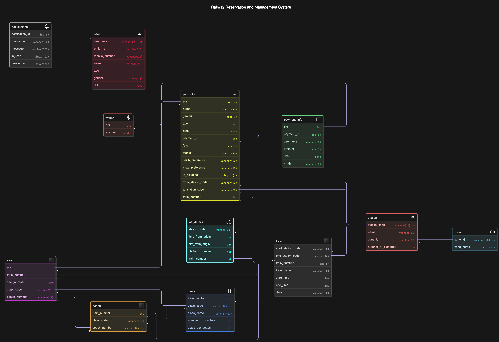

### TRAIN RESERVATION AND MANAGEMENT SYSTEM

### Project Overview
This project, is a comprehensive Train Reservation and Management System built using MySQL. The system simulates real-world railway operations, enabling users to manage bookings, track train statuses, and analyze system data.The system reflects data up to this point, providing a robust framework for train ticket management, payment processing, and passenger tracking.

### Features
- User Management: The login_register stored procedure allows users to register with an email, password, name, mobile number, age, gender, and date of birth, or log in if the account exists. It checks for existing users and validates credentials, returning success or error messages.
- Ticket Booking: The book_train_ticket function facilitates ticket reservations, accepting parameters such as username, passenger details, travel date, stations, class code, train number, berth preference, meal preference, and disability status. It generates a unique PNR, calculates fares based on distance and class, applies discounts (e.g., 25% for disabled, 40% for seniors), and assigns seats or RAC/WL status based on availability.
- Cancellation: The cancel_ticket procedure handles ticket cancellations, retrieving fare and travel details, calculating refunds based on time remaining (75% >48 hours, 50% 4-48 hours, 0% <4 hours with a minimum Rs. 120 charge), and promoting RAC/WL passengers to confirmed seats. It updates related tables and logs refunds.
- Status Tracking: The track_pnr_status procedure provides detailed PNR information, including passenger name, train details, status (CNF/RAC/WL), seat assignment, and payment details, with a check for chart preparation based on travel date and time.
  
- Train Tracking: The track_train_by_number procedure simulates live train tracking, displaying scheduled and actual arrival/departure times, delays, current location, and station details using a temporary table and random delay simulation for past or current dates.
- Availability Queries: The get_available_seats function calculates remaining seats for a given train, class, and date, while get_waitlisted_passengers lists all waitlisted passengers for a train.
- Analytics:
  - get_train_cancellation_refunds generates a formatted report of refunds for a cancelled train.
  - calculate_total_revenue computes revenue between dates for a specific train or all trains.
  - busiest_route identifies the route with the highest passenger count on a given date.
- Data Insights: Various SQL queries summarize users, trains, passengers, payments, stations, zones, refunds, seats, coaches, and classes, providing statistical overviews like averages and totals.

### System Architecture
- Entities and Relationships: The system models entities such as Passenger (user), Train, Ticket (pax_info), Payment, Route (via_details), Station, Seat, and Class. Relationships include "Passenger books Ticket," "Ticket is for Train," and "Train operates via Stations." Circular foreign key constraints are managed with temporary disabling during deletions.
- Database Schema: A normalized relational schema with primary keys (e.g., pnr, train_number) and foreign keys (e.g., payment_id in pax_info). Key tables include:
  - user: Stores email_id (PK), mobile_number, username, name, age, gender, dob, and password.
  - train: Contains train_number (PK), train_name, start_station_code, end_station_code, start_time, end_time, and days.
  - pax_info: Manages pnr (PK), passenger details, travel info, status (e.g., CNF/1/1), and payment_id.
  - payment_info: Tracks payment_id (PK), pnr, username, amount, date, and mode.
  - refund: Records pnr (PK) and amount.
  - seat: Allocates seat_number, pnr, train_number, class_code, and coach_number.
  - station: Lists station_code (PK), name, zone_id, and number_of_platforms.
  - zone: Defines zone_id (PK) and zone_name.
  - via_details: Tracks train_number, station_code, and dist_from_origin.
  - class: Specifies train_number, class_code (composite PK), number_of_coaches, and seats_per_coach.
  - coach: Links train_number, class_code, and coach_number.
- Stored Procedures/Functions: Written in MySQL, these routines handle complex logic:
  - Use temporary tables for seat allocation and status updates.
  - Implement fare calculations with class factors (e.g., 3.0 for 1A, 1.0 for SL) and meal charges (Rs. 200 VEG, Rs. 250 NONVEG).
  - Manage transactions for data consistency during cancellations.

### Installation and Setup
1. Prerequisites: Install MySQL server (version 5.7 or higher) and a client like MySQL Workbench.
2. Database Creation:
   - Create a new database: CREATE DATABASE train_reservation; USE train_reservation;
   - Execute the SQL scripts from the attached files (dbms txt.txt, dbms q final.txt, etc.) to define tables, procedures, and functions.
   - Ensure proper data types (e.g., VARCHAR(20) for station_code, INT for train_number) and constraints (e.g., NOT NULL where applicable).
3. Configuration:
   - Add indexes on frequently queried fields (e.g., CREATE INDEX idx_pnr ON pax_info(pnr);) to optimize performance.
   - Set foreign_key_checks = 0 temporarily during schema updates if needed, then re-enable.
   - Populate initial data using INSERT statements from dbms queries'.txt.

### Usage Examples
- Register/Login: CALL login_register('newuser@example.com', 'pass123', 'New User', '1234567890', 30, 'M', '1995-01-01'); returns "Registration successful! You have logged in!" or login status.

- Book Ticket: SELECT book_train_ticket("newuser", "New User", "M", 30, "2025-04-17", "NDLS", "HWH", "12301/1A", 12301, "LB", "VEG", 0); returns a PNR (e.g., 1212515249).

- Cancel Ticket: CALL cancel_ticket(1212515842); outputs a success message with refund amount (e.g., "Ticket with PNR 1212515842 cancelled successfully. Refund amount: Rs. 2298").

- Track PNR: CALL track_pnr_status(1212515249); displays passenger details, status (e.g., CNF/1/1), seat, and payment info.

- Track Train: CALL track_train_by_number(12301, "2025-04-15"); shows train info, current location, and station-wise schedule with delays.

- Available Seats: SELECT get_available_seats(12301, "1A", "2025-04-17"); returns 43 seats.
- Waitlist: CALL get_waitlisted_passengers(12301); lists waitlisted passengers.

- Refunds: SELECT get_train_cancellation_refunds(12301, '2025-04-17'); provides a refund report.
- Revenue: SELECT calculate_total_revenue('2025-04-13', '2025-04-17', 12301); returns total fare sum.
- Busiest Route: CALL busiest_route('2025-04-17'); identifies the most popular route.

### Data Summary
- Users: 23 total, with diverse ages (19-72) and genders (25 male, 29 female).
- Trains: 30 total, operating from 11 unique start stations to 19 unique end stations, with start times from 06:15:00 to end times at 17:40:00.
- Passengers: 54 total, average age 35.78, average fare 4471.49, min fare 1149, max fare 4796, 1 disabled passenger.
- Payments: 54 total, total amount 241460.2, average payment 4471.49, all online mode.
- Stations: 40 total, 18 unique zones, 302 total platforms (average 7.55, min 3, max 23).
- Via Details: 105 entries, 30 unique trains, 28 unique stations, average distance 757.25 km (min 0 km, max 3031 km).
- Zones: 18 total, all unique.
- Refunds: 3 total, total amount 5974.8, average 1991.60, min 1378.8, max 2298.
- Seats: 43 allocated, 42 unique bookings, 1 unique train, 1 unique class, 2 unique coaches, seat range 1-24.
- Coaches: 2 total, 1 unique train, 1 unique class, 2 unique coach numbers.
- Classes: 114 total, average 4.6 coaches, average 64.3 seats per coach, min 1 coach, max 10 coaches, min 24 seats, max 108 seats.

### Development Notes
- Performance Optimization: Index fields like pnr, train_number, and date to enhance query speed, especially for large datasets (e.g., 200,000 train routes). Use EXPLAIN to analyze query plans.
- Refund Logic: Test cancellation policies rigorously, as they involve time-based calculations and temporary table operations. Ensure TIMESTAMPDIFF accuracy for refund thresholds.
- Scalability: The schema supports scalability with normalized tables and efficient joins. Use partitioning for pax_info if passenger numbers grow significantly.
- Data Integrity: Handle circular foreign key constraints (e.g., payment_info and pax_info) by disabling checks during deletions. Validate input data (e.g., date formats) to prevent errors.
- Backup Strategy: Regularly export the database using mysqldump (e.g., mysqldump -u root -p train_reservation > backup.sql) to safeguard against data loss.

### Team
- Ishika Gupta(2301AI10)
- Sakshi Saxena(2301CS45)
- Manshi Prajapati(2302CS08)
- Swati Yadav(2301CS85)
